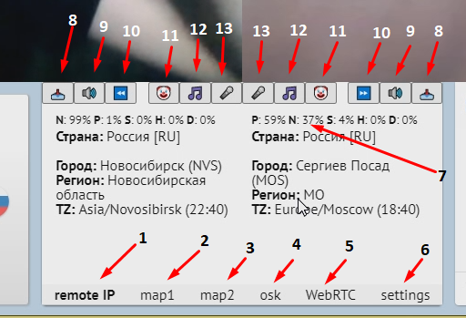

[<sup>Подробнее о программе для 'взлома' Чат Рулетки videochatru-mitm на русском языке можно прочитать по этой ссылке</sup>](README_RU.md)  
<h1 align="center">videochatru-mitm</h1>

<p align="center">


</p>

**This is an advanced desktop [Chatruletka (ome.tv)](https://github.com/qrlk/videochatru-extension#what-is-chat-roulette) client which is focused on the needs of YouTubers.**  

**It has the ability to connect interlocutors with each other and interfere in their conversations.**

<p align="center">
  
</p>

--------------
### **videochatru-mitm** is provided for educational purposes only.
### Usage of it for other purposes might be illegal in your country.  
### Developers assume no liability and are not responsible for any misuse or damage caused by this program.
--------------
## Information
The program is incomplete and requires skills to set up.

It is terribly coded and there were no plans to publish it at all.

It is heavily dependant on **[OBS](https://github.com/qrlk/videochatru-mitm#setup-obs)** and **[VoiceMeeter Potato](https://github.com/qrlk/videochatru-mitm#setup-voicemeeter)**.

**If you are a casual user, [go here](https://github.com/qrlk/videochatru-extension).**

## Features
* **Connect the two interlocutors to each other.**
* **Manipulate their cameras using OBS.**
* **Manipulate their audio feeds using videochatru-mitm's control panel and voicemeeter.**
  * Add your mic.
  * Add music.
  * Add any voicemeeter input such as discord.
* Determine the location of the interlocutors by their IP addresses.
* Determine the current time in the location of the interlocutors.
* Enable mirror mode.
* Show a map of the interlocutors's cities.
* Take a full screenshot of the interlocutor's cameras.
* Hide the video chat watermark / banner.
* Clear session if you're banned.
* Convenient keyboard shortcuts for the most popular buttons.
* Control panel with an **[optional remote control](remote%20control)**.
## Control panel
<details>
 <summary>Controls</summary>  
 
 1. Remote IP addresses page.
 2. The first interlocutor's location.
 3. The second interlocutor's location.
 4. Nickname generator (Russian).
 5. WebRTC status 1 - 2.
 6. Settings page.
 7. NSFW detector (extracted from the published version).
 8. Make a screenshot of the 1st / 2nd camera (create a "videochatru" folder in your Downloads).
 9. Mute the first or second interlocutor.
 10. Skip the 1st / 2nd interlocutor. 
 11. Push-To-Talk for discord (right click to switch).
 12. Switch input from a music player.
 13. Push-to-talk for your mic (right click to switch).
</details>

## Installation
**Videochatru-mitm** is provided for educational purposes only.  

**If you want to learn how videochatru-mitm works, then you will have to build it yourself.**

You will have to clone/download the repository, install **[nodejs](http://nodejs.org/en/download)**, open the command line in the repository.

Follow the instructions:
* **[Setup OBS](https://github.com/qrlk/videochatru-mitm#setup-obs)**
* **[Setup VoiceMeeter Potato](https://github.com/qrlk/videochatru-mitm#setup-voicemeeter)**
* **[Actually build videochatru-mitm](https://github.com/qrlk/videochatru-mitm#build-for-windows)**

P.S. You will need several social media accounts if strange activity has been recorded from your IP.

## Setup OBS
**videochatru-mitm** depends on [OBS-Studio](https://obsproject.com) to capture each interlocutor's camera and stream it to the directshow virtual webcamera ([obs-virtual-cam](https://github.com/Fenrirthviti/obs-virtual-cam)).
<details>
 <summary>Setup OBS</summary>  
  
* Install [OBS-Studio](https://obsproject.com/).
* Install [obs-virtual-cam](https://github.com/Fenrirthviti/obs-virtual-cam).
  * Select 4 cameras.
* (optional) change each camera's name.
  * Open regedit.exe.
  * Search for "obs-camera".
  * Replace each unique camera to something unique like "CAMERA1"/"CAMERA2"/"CAMERA3"/"CAMERA4".
* Select the OBS output resolution: 640x480.
* Select the OBS bitrate output ~900 kbps (?).
* Enable Studio mode.
* Create two scenes, on each capture each videochatru-mitm's window and crop it so that the interlocutor's camera occupies the entire screen.
* Create a scene filter Virtual Camera and select CAMERA1/CAMERA2, press 'start'.
* Select the first scene, then press 'Transition', then select second scene so they both cameras can work.
* Pass these camera names as a command-line arguments later.

P.S. Always start filter output before reading input from the camera, otherwise the camera's extension will be fixed at 1920x1080 until reboot.
</details>

## Setup VoiceMeeter
**videochatru-mitm** depends on [VoiceMeeter Potato](https://vb-audio.com/Voicemeeter/potato.htm) to manipulate audio.
<details>
 <summary>Setup VoiceMeeter Potato</summary>  
  
* Install [VoiceMeeter Potato](https://vb-audio.com/Voicemeeter/potato.htm).
* Select your mic at `HARWARE INPUT 5`
* Select your speaker at `HARDWARE OUTPUT A1`
* Select `VAIO 3` as the default sound output on your pc.
* Make sure that `Virtual Input VoiceMeeter VAIO` has `A1` and `B1` enabled.
* Make sure that `Virtual Input VoiceMeeter AUX` has `A1` and `B2` enabled.
* `HARWARE INPUT 4` and `HARWARE INPUT 3` are used as discord/music input, use [VAC](https://vac.muzychenko.net/en/) if you want this functionality.

P.S. You should run VoiceMeeter on every startup (there is also a such option), otherwise you won't have sound.  
</details>

## How does it work?
**Videochatru-mitm connects 2 random interlocutors and allows user to control their conversation.**
<details>
 <summary>How it works</summary>  
  
* **Videochatru-mitm** creates two [BrowserWindow](https://www.electronjs.org/docs/api/browser-window)'s instances with https://videochatru.com/embed in each one.
* **Videochatru-mitm** injects a control panel into [videochatru](https://videochatru.com)'m DOM.
  * There is also a [remote control](remote%20control).
* [Integrated extensions](https://github.com/qrlk/videochatru-mitm#anti-fingerprint-extensions) bypass fingerprinting so both istances can work together.
* [Obs-studio](https://obsproject.com/) captures each instance's interlocutor's cam and outputs it through [obs-virtual-cam](https://github.com/Fenrirthviti/obs-virtual-cam).
  * **Videochatru-mitm** selects the other interlocutor's camera input based on the [command line arguments](https://github.com/qrlk/videochatru-mitm#command-line-arguments) passed to it.
* [VoiceMeeter Potato](https://vb-audio.com/Voicemeeter/potato.htm) handles audio mixering, receiving commands from users via [voicemeeter-connector](https://github.com/ChewbaccaCookie/voicemeeter-connector).
  * **Videochatru-mitm** selects speaker output based on the [command line arguments](https://github.com/qrlk/videochatru-mitm#command-line-arguments) passed to it.
  * **Videochatru-mitm** selects fake mic based on the [command line arguments](https://github.com/qrlk/videochatru-mitm#command-line-arguments) passed to it.


I experimented with webrtc to implement [mitm](https://en.wikipedia.org/wiki/Man-in-the-middle_attack), but due to some chrome bugs and unpleasant delays, it was easier to stay dependent on [VoiceMeeter Potato](https://vb-audio.com/Voicemeeter/potato.htm)/[obs-virtual-cam](https://github.com/Fenrirthviti/obs-virtual-cam).
</details>

## Build for Windows

```cmd
> cd src
> npm install
> npm run build
```
The portable exe file will appear in the build folder as well as the unpacked folder.  

Run the executable file. You should use [command line arguments](https://github.com/qrlk/videochatru-mitm#command-line-arguments) to configure it.
## Run in debug mode

```cmd
> cd src
> npm install
> npm start -- --dev --id1=1 --id2=2
```
## Command line arguments
To configure the program for yourself, you need to use command-line arguments. 

For example, when you install and configure [Voicemeeter Potato](https://github.com/qrlk/videochatru-mitm#setup-voicemeeter) and [obs-virtual-cam](https://github.com/qrlk/videochatru-mitm#setup-obs), something like this would be enough:

> `videochatru-mitm.exe --id1=4 --id2=5 --cam1=OBS-Camera2 --cam2=OBS-Camera --mic2='VoiceMeeter Output (VB-Audio VoiceMeeter VAIO)' --mic1='VoiceMeeter Aux Output (VB-Audio VoiceMeeter AUX VAIO)' --spk2='VoiceMeeter Aux Input (VB-Audio VoiceMeeter AUX VAIO)' --spk1='VoiceMeeter Input (VB-Audio VoiceMeeter VAIO)' `
<details>
<summary>all arguments</summary>

### window n1
* `id1` - id of the permanent [session](https://www.electronjs.org/docs/api/session ) for the first window.
  * **By default:** 1.
* `cam1` is the name of the camera for the first window.
  * This camera will be selected from the list.
  * Specify here the camera that shows the image from another window.
* `mic1` is the name of the microphone for the first window.
  * This microphone will be selected from the list.
  * Specify here the virtual cable to which the sound comes from another window.
* `spk1` is the name of the audio output device for the first window.
  * This audio output device will be selected from the list.
  * Specify here the virtual cable to which you want to send audio to another window.
### window n2
* `id2` - id of the permanent [session](https://www.electronjs.org/docs/api/session ) for the first window.
  * **By default:** 2.
* `cam2` is the name of the camera for the second window.
  * This camera will be selected from the list.
  * Specify here the camera that shows the image from another window.
* `mic2` is the name of the microphone for the second window.
  * This microphone will be selected from the list.
  * Specify here the virtual cable to which the sound comes from another window.
* `spk2` is the name of the microphone for the second window.
  * This audio output device will be selected from the list.
  * Specify here the virtual cable to which you want to send audio to another window.
### voicemeeter
* `input1` is the Voicemeeter input number to which the sound comes from the first window.
  * **By default:** 5.
* `input2` is the Voicemeeter input number to which the sound comes from the second window.
  * **By default:** 6.
* `inputmic` is the Voicemeeter input number that your microphone is on.
  * **By default:** 4.
* `inputmusic` is the Voicemeeter input number on which the virtual cable that the music comes from the player is on.
  * **By default:** 2.
* `inputdiscord` - the number of the Voicemeeter input on which the virtual cable to which the sound from the discord comes.
  * **By default:** 3.
* `outputspeaker` - the number of the VoiceMeeter output to your headphones.
  * **By default:** 0.
* `outputmicmusictodiscord` is the VoiceMeeter output number where the music will be output if you want to mix it with a microphone and output it to discord.
  * **By default:** 1.
<details>
<summary>Numbers</summary>

* 0 - A1
* 1 - A2
* 2 - A3
* 3 - A4
* 4 - A5
* 5 - B1
* 6 - B2
* 7 - B3
</details>

### other
* `ws` - is the web socket address of the server for remote management.
* `checkip` - if specified, it will show information about your IP at the start.

</details>

## Build for Linux and Mac
Building for Linux and Mac doesn't make sense, since **videochatru-mitm** depends on **[VoiceMeeter Potato](https://vb-audio.com/Voicemeeter/potato.htm)**, which is only available on Windows.

## Contribution
I have no motivation/interest/time for further development of this project.  

I am not interested in pull requests and cannot guarantee that they will be reviewed.

It may still be worth sending pull requests in case it will be useful to someone even without a review.

A pull request with corrections of my English in the readme is welcome!

## Background
**I was developing this project for my cancelled YouTube/TikTok project.**

The idea was to create a convenient tool that would allow to perform a **[Man-in-the-middle attack](https://en.wikipedia.org/wiki/Man-in-the-middle_attack)** on a **[global Chat Roulette platform](https://github.com/qrlk/videochatru-extension#what-is-chat-roulette)** so that I could interfere in conversations in random Internet video chats in order to record pranks/stream them safely.


Creative interference in conversations caused funny and sometimes absurd situations that could well be used as a format for entertaining content on the Internet.

The client also had to provide a user-friendly interface for managing the program and additional functions, such as remote control or hiding NSFW images from the cameras of the interlocutors (this was cut of the published version).

This YouTube project was supposed to be a source of income and free PR for the in-development **[adwhore.net](https://adwhore.net)**'s successor, which could anger many popular corrupt influencers on the internet.

After bloggers in Russia started using their influence to resolve their personal conflicts, often with the help of an administrative resource, my potential YouTube project became a legal vulnerability for me because pranks on the Internet have always been in the gray zone of the law.  

**I had to give it up, despite a lot of time spent on it.**

A stable unfinished version has been published in this repository for educational purposes, while other implemented ideas have moved to the user-friendly **[videochatru-extension](https://github.com/qrlk/videochatru-extension)** in the Chrome extension format.

## Creds
**videochatru-mitm is based on https://github.com/vicimpa/chatroulette**

### libs
* https://jquery.com/
* https://github.com/uzairfarooq/arrive
* https://docs.2gis.com/ru/mapgl/overview
* https://github.com/ChewbaccaCookie/voicemeeter-connector

### anti-fingerprint extensions

* [Canvas Fingerprint Defender](https://chrome.google.com/webstore/detail/canvas-fingerprint-defend/lanfdkkpgfjfdikkncbnojekcppdebfp)
* [Font Fingerprint Defender](https://chrome.google.com/webstore/detail/font-fingerprint-defender/fhkphphbadjkepgfljndicmgdlndmoke)
* [Webgl Fingerprint Defener](https://chrome.google.com/webstore/detail/webgl-fingerprint-defende/olnbjpaejebpnokblkepbphhembdicik)
* [Audiocontext Fingerprint Defender](https://chrome.google.com/webstore/detail/audiocontext-fingerprint/pcbjiidheaempljdefbdplebgdgpjcbe)
