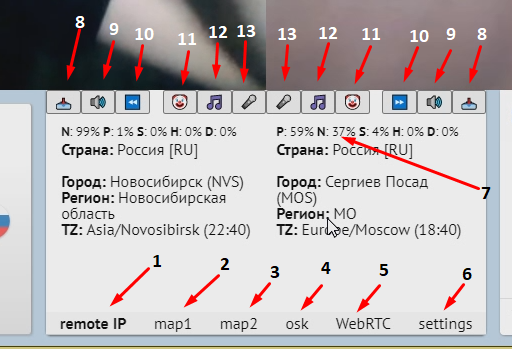

<h1 align="center">videochatru-mitm</h1>

<p align="center">


</p>

**Это продвинутый десктопный клиент для [Чат-рулетки (ome.tv)](https://github.com/qrlk/videochatru-extension/blob/main/README_RU.md#%D1%87%D1%82%D0%BE-%D1%82%D0%B0%D0%BA%D0%BE%D0%B5-%D1%87%D0%B0%D1%82-%D1%80%D1%83%D0%BB%D0%B5%D1%82%D0%BA%D0%B0), ориентированный на потребности Ютуберов.**

**С его помощью можно соединять собеседников между собой и вмешиваться в их разговоры.**

<p align="center">
  
</p>

--------------
### **videochatru-mitm** предоставляется только в образовательных целях.
### Использование его в других целях может быть незаконным в вашей стране.
### Разработчики не несут никакой ответственности за любое нецелевое использование или ущерб, причиненный этой программой.
--------------
## Информация
Программа недоработана и требует серьёзных компьютерных навыков для настройки, а может даже и высшего образования.

Программа ужасно кодирована, и ее вообще не планировалось публиковать.

Программа сильно зависит от **[OBS](https://github.com/qrlk/videochatru-mitm#setup-obs)** и **[VoiceMeeter Potato](https://github.com/qrlk/videochatru-mitm#setup-voicemeeter)**.

**Если вы казуальный пользователь, [вам сюда](https://github.com/qrlk/videochatru-extension).**

## Функции
* **Соединение двух собеседников друг с другом.**
* **Манипуляция их изображением при помощи OBS.**
* **Манипуляция их аудиопотоками с помощью панели управления videochatru-mitm и voicemeeter.**
  * Можно добавить звук со своего микрофона.
  * Можно добавить музыку.
  * Можно добавить любой VoiceMeeter Input, такой как discord.
* Определение возможного местоположения собеседников по их IP-адресам.
* Определение текущего времени в локациях собеседников.
* Зеркальный режим.
* Отображение карты города собеседников.
* Можно сделать полный снимок камеры собеседника.
* Скрытие водяного знака / баннера видеочата.
* Кнопка очищения данных сеанса, если вы забанены.
* Удобные сочетания клавиш для самых популярных кнопок.
* Панель управления с **[дистанционным управлением](remote%20control)**.
## Панель управления
<details>
 <summary>Controls</summary>  

1. Страница IP-адресов.
2. Местонахождение первого собеседника.
3. Местонахождение второго собеседника.
4. Генератор оскорблений.
5. Статус WebRTC 1 - 2.
6. Страница настроек.
7. Детектор NSFW (вырезан из опубликованной версии).
8. Скриншот камеры 1-го/2-го собеседника (создайте папку "videochatru" в ваших загрузках).
9. Отключить звук первому или второму собеседника.
10. Пропуск 1-го/2-го собеседника.
11. Нажмите, чтобы включить звук из дискорда (правый клик - переключить).
12. Нажмите, чтобы включить звук из плеера (правый клик - переключить).
13. Нажмите, чтобы включить звук из микрофона (правый клик - переключить).
</details>

## Установка
**videochatru-mitm** предоставляется только в образовательных целях.

**Если вы хотите узнать, как работает videochatru-mitm, вам придется собрать его самостоятельно.**

Вам нужно будет клонировать/загрузить репозиторий, установить **[nodejs](http://nodejs.org/en/download)** и открыть командную строку в репозитории.

Следуйте инструкциям:
* **[Настройка OBS](https://github.com/qrlk/videochatru-mitm/blob/main/README_RU.md#%D0%BD%D0%B0%D1%81%D1%82%D1%80%D0%BE%D0%B9%D0%BA%D0%B0-obs)**
* **[Настройка голосового приемника картофеля](https://github.com/qrlk/videochatru-mitm/blob/main/README_RU.md#%D0%BD%D0%B0%D1%81%D1%82%D1%80%D0%BE%D0%B9%D0%BA%D0%B0-voicemeeter)**
* **[Сборка под Windows](https://github.com/qrlk/videochatru-mitm#build-for-windows)**

P.S. Вам понадобится несколько аккаунтов в социальных сетях, если с вашего IP-адреса ранее была зафиксирована странная активность. Автореги ВК стоят копейки, нужно только поискать.

## Настройка OBS
**videochatru-mitm** зависит от [OBS-Studio](https://obsproject.com) для захвата камеры каждого собеседника и трансляции ее на виртуальную веб-камеру directshow ([obs-virtual-cam](https://github.com/Fenrirthviti/obs-virtual-cam)).
<details>
<summary>Настройка OBS</summary>

* Установите [OBS-Studio](https://obsproject.com/).
* Установите [obs-virtual-cam](https://github.com/Fenrirthviti/obs-virtual-cam).
  * Выберите 4 камеры.
* Измените название каждой камеры (необязательно).
  * Откройте regedit.exe.
  * Найдите значения "OBS-Camera".
  * Замените каждую уникальную камеру на что-то уникальное, например "CAMERA1"/"CAMERA2"/"CAMERA3"/"CAMERA4".
* Выберите выходное разрешение OBS: 640x480.
* Выберите выходной битрейт OBS ~900 кбит/с (?).
* Включите студийный режим.
* Создайте две сцены, на каждой захватите каждое окно видеочата и обрежьте его так, чтобы камера собеседника занимала весь экран сцены.
* Создайте фильтр сцен - виртуальную камеру, выберите CAMERA1/CAMERA2, нажмите "Пуск" (на двух сценах).
* Выберите первую сцену, затем нажмите "Переход", затем выберите вторую сцену так, чтобы обе камеры могли работать.
* Передайте эти имена камер в качестве аргументов командной строки программе.

P.S. Всегда запускайте камеру перед программой, в противном случае расширение камеры будет зафиксировано на 1920х1080 до перезагрузки.
</details>

## Настройка VoiceMeeter
**videochatru-mitm** зависит от [VoiceMeeter Potato](https://vb-audio.com/Voicemeeter/potato.htm) для манипуляций со звуком.
<details>
<summary>Настройка VoiceMeeter Potato</summary>

* Установите [VoiceMeeter Potato](https://vb-audio.com/Voicemeeter/potato.htm).
* Выберите свой микрофон на `HARWARE INPUT 5`
* Выберите свой динамик в разделе `HARDWARE OUT A1`.
* Выберите "VAIO 3" в качестве звукового выхода по умолчанию на вашем компьютере.
* Убедитесь, что в `Virtual Input VoiceMeeter VAIO` включены `A1` и `B1`.
* Убедитесь, что `Virtual Input VoiceMeeter AUX` имеет `A1` и `B2` включены.
* `HARWARE INPUT 4` и `HARWARE INPUT 3` используются в качестве входа из Discord / музыки, используйте [VAC](https://vac.muzychenko.net/en/), если вам нужна эта функциональность.

P.S. Вы должны запускать VoiceMeeter при старте ПК, иначе у вас не будет звука.
</details>

## Как это работает?
**videochatru-mitm соединяет 2 случайных собеседника и позволяет пользователю контролировать их разговор.**
<details>
<summary>Как это работает</summary>

* **Videochatru-mitm** создает два экземпляра [браузера](https://www.electronjs.org/docs/api/browser-window) с https://videochatru.com/embed в каждом из них.
* **Videochatru-mitm** инжектит панель управления в DOM сайта [видеочатру](https://videochatru.com).
  * Также имеется [пульт дистанционного управления](remote%20control).
* [Встроенные расширения](https://github.com/qrlk/videochatru-mitm/blob/main/README_RU.md#anti-fingerprint-extensions) обходят фингерпринтинг, чтобы оба инстанса могли работать одновременно.
* [OBS-студия](https://obsproject.com/) захватывает камеру собеседника каждого экземпляра и выводит ее через [obs-virtual-cam](https://github.com/Fenrirthviti/obs-virtual-cam).
  * **Videochat-mitm** выбирает вход камеры другого собеседника на основе [аргументов командной строки](https://github.com/qrlk/videochatru-mitm/blob/main/README_RU.md#%D0%B0%D1%80%D0%B3%D1%83%D0%BC%D0%B5%D0%BD%D1%82%D1%8B-%D0%BA%D0%BE%D0%BC%D0%B0%D0%BD%D0%B4%D0%BD%D0%BE%D0%B9-%D1%81%D1%82%D1%80%D0%BE%D0%BA%D0%B8), переданных ему.
* [VoiceMeeter Potato](https://vb-audio.com/Voicemeeter/potato.htm ) обрабатывает микширование звука, получая команды от пользователей через [voicemeeter-connector](https://github.com/ChewbaccaCookie/voicemeeter-connector).
  * **Videochat-mitm** выбирает выход динамика на основе [аргументов командной строки](https://github.com/qrlk/videochatru-mitm/blob/main/README_RU.md#%D0%B0%D1%80%D0%B3%D1%83%D0%BC%D0%B5%D0%BD%D1%82%D1%8B-%D0%BA%D0%BE%D0%BC%D0%B0%D0%BD%D0%B4%D0%BD%D0%BE%D0%B9-%D1%81%D1%82%D1%80%D0%BE%D0%BA%D0%B8), переданных ему.
  * **Videochat-mitm** выбирает вход микрофона на основе [аргументов командной строки](https://github.com/qrlk/videochatru-mitm/blob/main/README_RU.md#%D0%B0%D1%80%D0%B3%D1%83%D0%BC%D0%B5%D0%BD%D1%82%D1%8B-%D0%BA%D0%BE%D0%BC%D0%B0%D0%BD%D0%B4%D0%BD%D0%BE%D0%B9-%D1%81%D1%82%D1%80%D0%BE%D0%BA%D0%B8), переданных ему.

Я экспериментировал с webrtc для реализации [mitm](https://en.wikipedia.org/wiki/Man-in-the-middle_attack ), но из-за некоторых ошибок chrome и неприятных задержек было проще оставаться зависимым от [Voicemeeter Potato](https://vb-audio.com/Voicemeeter/potato.htm)/[obs-virtual-cam](https://github.com/Fenrirthviti/obs-virtual-cam).
</details>

## Сборка для Windows

```cmd
> cd src
> npm install
> npm run build
```
Портативный exe-файл появится в папке `build`, там же будет распакованная версия.

Запустите исполняемый файл. Можно использовать [аргументы командной строки](https://github.com/qrlk/videochatru-mitm/blob/main/README_RU.md#%D0%B0%D1%80%D0%B3%D1%83%D0%BC%D0%B5%D0%BD%D1%82%D1%8B-%D0%BA%D0%BE%D0%BC%D0%B0%D0%BD%D0%B4%D0%BD%D0%BE%D0%B9-%D1%81%D1%82%D1%80%D0%BE%D0%BA%D0%B8), чтобы настроить его.
## Запуск в режиме отладки

```cmd
> cd src
> npm install
> npm start -- --dev --id1=1 --id2=2
```
## Аргументы командной строки
Чтобы настроить программу для себя, вам необходимо использовать аргументы командной строки.

Например, после установки и настройки [Voicemeeter Potato](https://github.com/qrlk/videochatru-mitm/blob/main/README_RU.md#%D0%BD%D0%B0%D1%81%D1%82%D1%80%D0%BE%D0%B9%D0%BA%D0%B0-voicemeeter) и [obs-virtual-cam](https://github.com/qrlk/videochatru-mitm/blob/main/README_RU.md#%D0%BD%D0%B0%D1%81%D1%82%D1%80%D0%BE%D0%B9%D0%BA%D0%B0-obs), программу лучше запускать вот так:

> `videochatru-mitm.exe --id1=4 --id2=5 --cam1=OBS-Camera2 --cam2=OBS-Camera --mic2='VoiceMeeter Output (VB-Audio VoiceMeeter VAIO)' --mic1='VoiceMeeter Aux Output (VB-Audio VoiceMeeter AUX VAIO)' --spk2='VoiceMeeter Aux Input (VB-Audio VoiceMeeter AUX VAIO)' --spk1='VoiceMeeter Input (VB-Audio VoiceMeeter VAIO)' `
<details>
 <summary>все аргументы</summary>
  
### window n1
* ``id1`` - id постоянной [сессии](https://www.electronjs.org/docs/api/session) для первого окна.
  * **По умолчанию:** 1.
* ``cam1`` - название камеры для первого окна.
  * Эта камера будет выбрана из списка.
  * Укажите здесь ту камеру, которая показывает изображение из другого окна.
* ``mic1`` - название микрофона для первого окна.
  * Этот микрофон будет выбран из списка.
  * Укажите здесь тот виртуальный кабель, на который приходит звук из другого окна.
* ``spk1`` - название устройства вывода звука для первого окна.
  * Это устройство вывода звука будет выбрано из списка.
  * Укажите здесь тот виртуальный кабель, на который нужно отправлять звук в другое окно.
### window n2
* ``id2`` - id постоянной [сессии](https://www.electronjs.org/docs/api/session) для первого окна.
  * **По умолчанию:** 2.
* ``cam2`` - название камеры для второго окна.
  * Эта камера будет выбрана из списка.
  * Укажите здесь ту камеру, которая показывает изображение из другого окна.
* ``mic2`` - название микрофона для второго окна.
  * Этот микрофон будет выбран из списка.
  * Укажите здесь тот виртуальный кабель, на который приходит звук из другого окна.
* ``spk2`` - название микрофона для второго окна.
  * Это устройство вывода звука будет выбрано из списка.
  * Укажите здесь тот виртуальный кабель, на который нужно отправлять звук в другое окно.
### voicemeeter
* `input1` - номер входа Voicemeeter, на который приходит звук из первого окна.
  * **По умолчанию:** 5.
* `input2` - номер входа Voicemeeter, на который приходит звук из второго окна.
  * **По умолчанию:** 6.
* `inputmic` - номер входа Voicemeeter, на котором ваш микрофон.
  * **По умолчанию:** 4.
* `inputmusic` - номер входа Voicemeeter, на котором виртуальный кабель, на который приходит музыка из плеера.
  * **По умолчанию:** 2.
* `inputdiscord` - номер входа Voicemeeter, на котором виртуальный кабель, на который приходит звук из дискорда.
  * **По умолчанию:** 3.
* `outputspeaker` - номер выхода VoiceMeeter на ваши наушники.
  * **По умолчанию:** 0.
* `outputmicmusictodiscord` - номер выхода VoiceMeeter, куда будет выводиться музыка, если вы хотите микшевать её с микрофоном и выводить в дискорд.
  * **По умолчанию:** 1.
<details>
 <summary>Номера</summary>

 * 0 - A1
 * 1 - A2
 * 2 - A3
 * 3 - A4
 * 4 - A5
 * 5 - B1
 * 6 - B2
 * 7 - B3
</details>
  
### other
* `ws` - адрес веб сокет сервера для удаленного управления.
* `checkIp` - если указано, на старте покажет информацию о вашем IP.
  
</details>

## Сборка для Linux и Mac
Сборка для Linux и Mac не имеет смысла, так как **videochatru-mitm** зависит от **[VoiceMeeter Potato](https://vb-audio.com/Voicemeeter/potato.htm)**, который доступен только в Windows.

## Вклад
У меня нет мотивации/времени для дальнейшего развития этого проекта.

Я не заинтересован в пул реквестах и не могу гарантировать, что они будут рассмотрены.

Возможно, все же стоит отправить пул реквест, если это может понадобиться кому-нибудь даже без его ревью.

## Предыстория
**Я разрабатывал этот проект для своего отмененного проекта YouTube / TikTok.**

Идея состояла в том, чтобы создать удобный инструмент, который позволил бы выполнять простую **[атаку Посредника](https://en.wikipedia.org/wiki/Man-in-the-middle_attack)** на **[глобальную платформу Чат-рулетки](https://github.com/qrlk/videochatru-extension/blob/main/README_RU.md#%D1%87%D1%82%D0%BE-%D1%82%D0%B0%D0%BA%D0%BE%D0%B5-%D1%87%D0%B0%D1%82-%D1%80%D1%83%D0%BB%D0%B5%D1%82%D0%BA%D0%B0)**, чтобы можно было вмешиваться в разговоры случайных людей и записывать пранки / безопасно транслировать их.

Креативное вмешательство в разговоры вызывало забавные, а иногда и абсурдные ситуации, которые вполне могли быть использованы в качестве формата развлекательного контента в Интернете.

Клиент также должен был предоставить удобный интерфейс для управления программой и дополнительные функции, такие как дистанционное управление или скрытие NSFW изображений с камер собеседников (это было вырезано из опубликованной версии).

Этот проект должен был стать источником дохода и бесплатного пиара для разрабатываемого преемника **[adwhore.net](https://adwhore.net)**, который может разозлить многих популярных коррумпированных Инфлюенсеров в Интернете.

После того, как блогеры в России начали использовать свое влияние для решения своих личных конфликтов, часто с помощью административного ресурса, мой потенциальный проект YouTube стал для меня риском, потому что пранки в Интернете всегда находились в серой зоне закона.

**Мне пришлось оставить этот проект, несмотря на то, что я потратил на подготовку материала много времени.**

Стабильная незаконченная версия была опубликована в этом репозитории в образовательных целях, в то время как другие удачные идеи перешли в удобное для пользователя **[videochatru-extension](https://github.com/qrlk/videochatru-extension)** в формате расширения Chrome.

## Креды
**videochatru-mitm основан на https://github.com/vicimpa/chatroulette**

### библиотеки
* https://jquery.com/
* https://github.com/uzairfarooq/arrive
* https://docs.2gis.com/ru/mapgl/overview
* https://github.com/ChewbaccaCookie/voicemeeter-connector

### anti-fingerprint extensions

* [Canvas Fingerprint Defender](https://chrome.google.com/webstore/detail/canvas-fingerprint-defend/lanfdkkpgfjfdikkncbnojekcppdebfp)
* [Font Fingerprint Defender](https://chrome.google.com/webstore/detail/font-fingerprint-defender/fhkphphbadjkepgfljndicmgdlndmoke)
* [Webgl Fingerprint Defener](https://chrome.google.com/webstore/detail/webgl-fingerprint-defende/olnbjpaejebpnokblkepbphhembdicik)
* [Audiocontext Fingerprint Defender](https://chrome.google.com/webstore/detail/audiocontext-fingerprint/pcbjiidheaempljdefbdplebgdgpjcbe)
