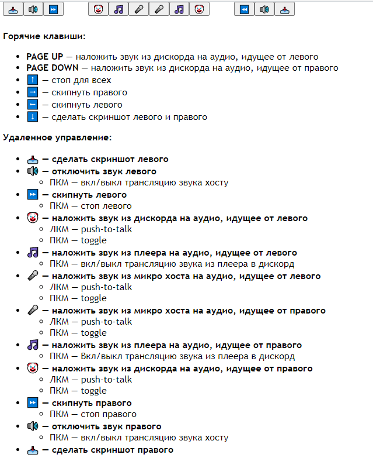

## remote control
The idea is to share access to the videochatru-mitm's control panel with someone else.  
It is useful because your friends in Discord can also talk to the interlocutors.

In addition to your microphone, videochatru-mitm supports hardcoded input from two more audio sources.  
It is assumed that one will have input from discord, and the other will have input from a music player.  

## voicemeeter setup (discord)
- You need to install a [virtual cable](https://vac.muzychenko.net/en/index.htm).
  - VAC is an audio bridge, it transmits sound from virtual output to virtual input.
  - Lite VAC version has a limit of 1 cable.
  - If you want more you should also [install this](https://vb-audio.com/Cable/).
- Configure the discord output to a virtual cable ([screen](screens/Screenshot_1.png)). 
- Add this virtual cable as a `HARDWARE INPUT 4` ([screen](screens/Screenshot_2.png)).
  - If you want to use a different input number, then you must pass its number as a [command line argument](https://github.com/qrlk/videochatru-mitm#command-line-arguments). 

## remote setup
- Communication between `remote.html` and the [control panel](https://github.com/qrlk/videochatru-mitm#control-panel) works through the websocket server `remote.py`.
- You must run `remote.py` on a server in order to use remote control functionality.
  - You should rent a VPS or use something like PythonAnywhere or heroku (this script consumes minimum resources).
  - Your server must have python3 and python3-pip installed.
  - Once you have it installed, just type 'pip install websocket_server' and 'python 3 remote.py` to run the server.
- Change ip/port in the beginning of remote.html to the one where the server is running.
- Pass your websocket url and port to videochatru-mitm as a [command line parameter](https://github.com/qrlk/videochatru-mitm#command-line-arguments): `--ws=ws://ip:port`.
- Host remote.html somewhere or just give it to a friend to run it in the browser.

## screenshot

